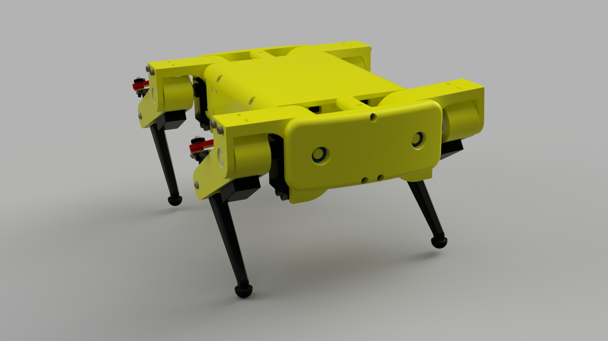
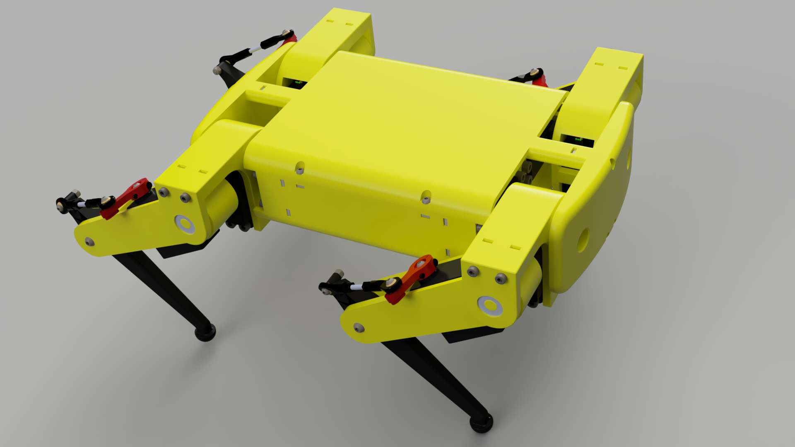
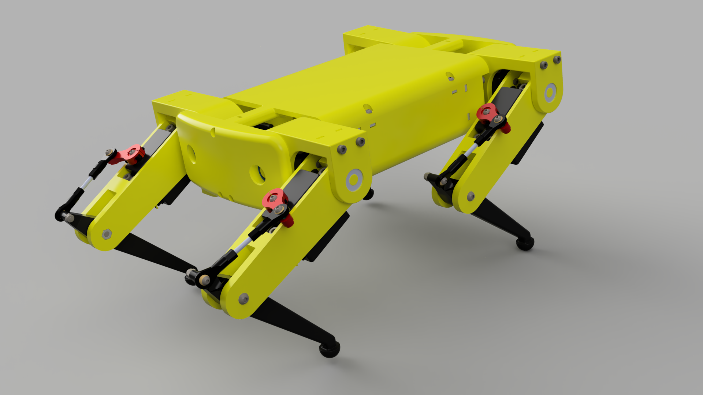
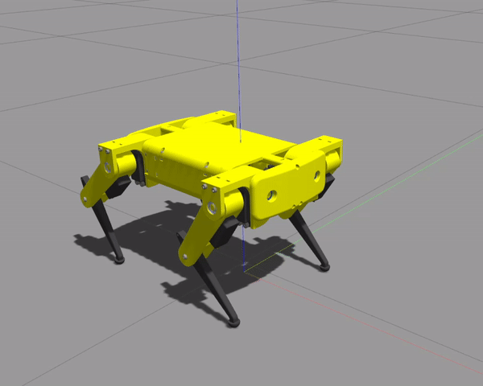

# "Notspot" is based on spotmicroai project

The MicriSpotAI has the following main components:

- Raspberry Pi 4B + 
- Raspberry Pi Camera
- UK 831N Multi tester
- MicroSD 32G 
- USB wlan / NEXT-202N-MINI
- 4 x 12A Step Down Module
- 2 × HC-SR04P Ultrasonic sensor
- 1 × MPU-6050 Gyro sensor
- 1 × I2C 16x2 LCD Module
- 7.4v Battery ( 2s2p )
- 6 x F625ZZ
- 2 x pca9685
- 12 x RDS5160 servo moter
- 20A Push button (Lock type)
- 18AWG
- 12V 5A Adaptor ( test )
- 50A LED Display
- PS4 DualShock compatible Joystick
- XT60H +/-
- HDMI to MICRO HDMI gender
- IMAX B6

# Notspot robot simulation - Python version
This repository contains all the files and code needed to simulate the notspot quadrupedal robot using [Gazebo](http://gazebosim.org/)  and [ROS](https://www.ros.org/).
The software runs on [ROS noetic](http://wiki.ros.org/noetic) and [Ubuntu 20.04](http://www.releases.ubuntu.com/20.04/). If you want to use a different ROS version, you might have to do some changes to the source code.
The robot is capable of walking, I have a bunch of videos on my [YouTube channel](https://www.youtube.com/channel/UCXlW03ZNOBB2UPEk8y_rGtA/videos). 

If you are interested in the C++ version, make sure to check [this](https://github.com/lnotspotl/notspot_sim_cpp) repository out.

   

## Setup
```
cd src && catkin_init_workspace
cd .. && catkin_make
source devel/setup.bash
roscd notspot_controller/scripts && chmod +x robot_controller_gazebo.py
cp -r RoboticsUtilities ~/.local/lib/python3.8/site-packages
roscd notspot_joystick/scripts && chmod +x ramped_joystick.py
```

## Run
```
source devel/setup.bash
roslaunch notspot run_robot_gazebo.launch
```
After all the nodes have started, you can start using your joystick to control the robot.

## Controllers
There's four different controllers, which make it easy to control the robot. These 4 controllers are: 
Rest controller, Stand Controller, Trot gait controller and Crawl gait controller. They were all developed in
Gazebo.

### Rest Controller


### Stand Controller


### Trot Gait Controller


### Crawl Gait Controller


## Other notes
This is my first open-source project, so I'm not that experienced with github just yet.

I'll be adding new stuff to this repository over time, so this is not the final version.
I'd like to make all the 3D models open-source, so that anybody can build this robot at home.

## Credits
 - mike4192: https://github.com/mike4192/spotMicro


## roslaunch notspot run_robot_gazebo.launch
roslaunch notspot run_robot_hardware.launch
roslaunch notspot_joystick ramped_joystick.launch
roslaunch notspot_mpu6050 mpu.launch
